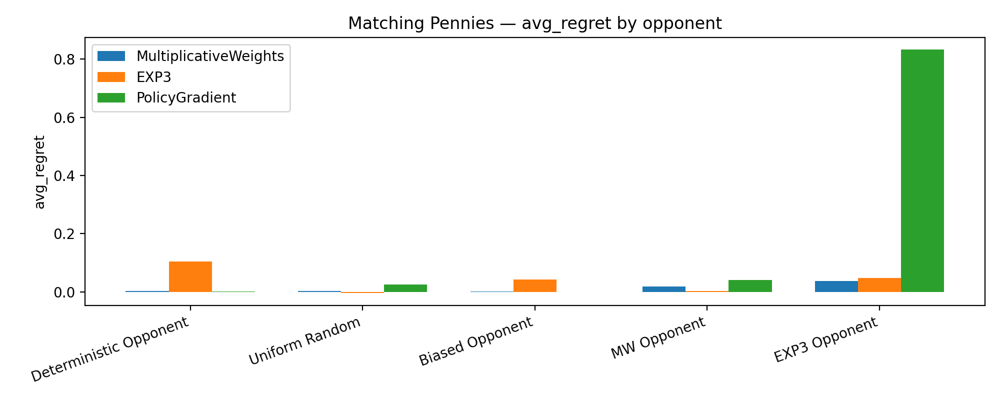
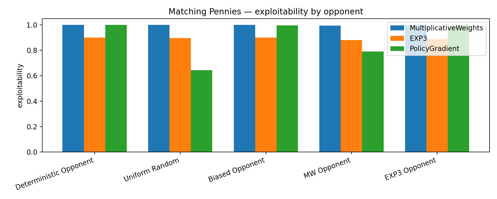
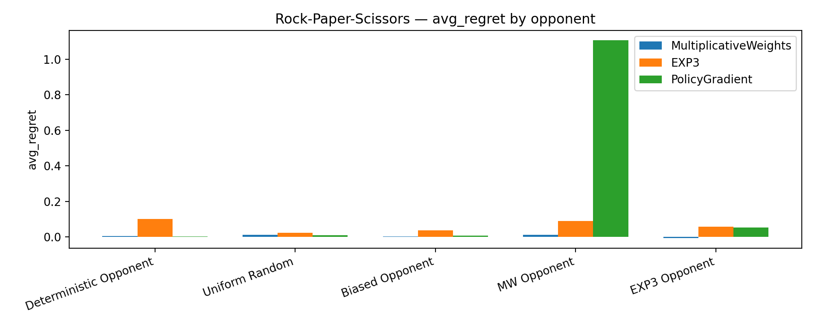
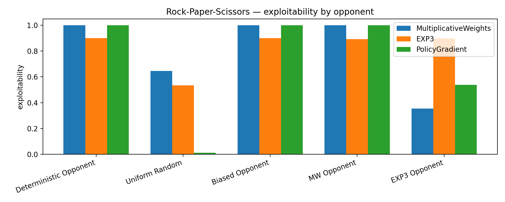

# Regret-Regularized-Policy-Gradient
Regret-regularized deep policy learning in repeated zero-sum games.

# Benchmarks:
#### Notes: 
- Cells are: Avg external regret per round (final exploitability). 
- Exploitability here is about how close the final policy is to a Nash strategy of the game, not “how well it did vs that opponent”

## Matching Pennies (3000 rounds)

### Regret/Exploitability:

| Opponent               | MultiplicativeWeights   | EXP3           | PolicyGradient   |
|:-----------------------|:------------------------|:---------------|:-----------------|
| Deterministic Opponent | 0.0027 (1.000)          | 0.1040 (0.900) | 0.0013 (1.000)   |
| Uniform Random         | 0.0033 (1.000)          | -0.0047 (0.896)| 0.0247 (0.643)   |
| Biased Opponent        | 0.0013 (1.000)          | 0.0427 (0.900) | 0.0000 (0.997)   |
| MW Opponent            | 0.0180 (0.995)          | 0.0033 (0.881) | 0.0407 (0.791)   |
| EXP3 Opponent          | 0.0367 (0.999)          | 0.0480 (0.889) | 0.8333 (0.991)   |

### Final policies

| Opponent               | MultiplicativeWeights   | EXP3           | PolicyGradient   |
|:-----------------------|:------------------------|:---------------|:-----------------|
| Deterministic Opponent | [1, 0]                  | [0.95, 0.05]   | [1, 0]           |
| Uniform Random         | [0, 1]                  | [0.0518, 0.9482]| [0.8217, 0.1783]|
| Biased Opponent        | [1, 0]                  | [0.95, 0.05]   | [0.9984, 0.0016] |
| MW Opponent            | [0.0025, 0.9975]        | [0.9407, 0.0593]| [0.1046, 0.8954]|
| EXP3 Opponent          | [0.0003, 0.9997]        | [0.0556, 0.9444]| [0.9957, 0.0043]|

## Rock Paper Scissors (3000 rounds)

| Opponent               | MultiplicativeWeights   | EXP3           | PolicyGradient   |
|:-----------------------|:------------------------|:---------------|:-----------------|
| Deterministic Opponent | 0.0040 (1.000)          | 0.1013 (0.900) | 0.0010 (1.000)   |
| Uniform Random         | 0.0120 (0.645)          | 0.0230 (0.535) | 0.0080 (0.011)   |
| Biased Opponent        | 0.0030 (1.000)          | 0.0353 (0.900) | 0.0073 (1.000)   |
| MW Opponent            | 0.0107 (1.000)          | 0.0890 (0.894) | 1.1073 (1.000)   |
| EXP3 Opponent          | -0.0080 (0.354)         | 0.0573 (0.898) | 0.0530 (0.538)   |

### Final Policies

| Opponent               | MultiplicativeWeights          | EXP3                         | PolicyGradient                 |
|:-----------------------|:-------------------------------|:-----------------------------|:-------------------------------|
| Deterministic Opponent | [0, 1, 0]                      | [0.0333, 0.9333, 0.0333]     | [0, 1, 0]                      |
| Uniform Random         | [0.0004, 0.6454, 0.3542]       | [0.568, 0.3987, 0.0333]      | [0.3415, 0.3285, 0.33]         |
| Biased Opponent        | [0, 1, 0]                      | [0.0333, 0.9333, 0.0333]     | [0, 1, 0]                      |
| MW Opponent            | [0.9999, 0, 0.0001]            | [0.9301, 0.0333, 0.0365]     | [0, 0, 0.9999]                 |
| EXP3 Opponent          | [0, 0.3543, 0.6457]            | [0.0343, 0.9324, 0.0333]     | [0.1421, 0.6798, 0.1781]       |

## Figures

